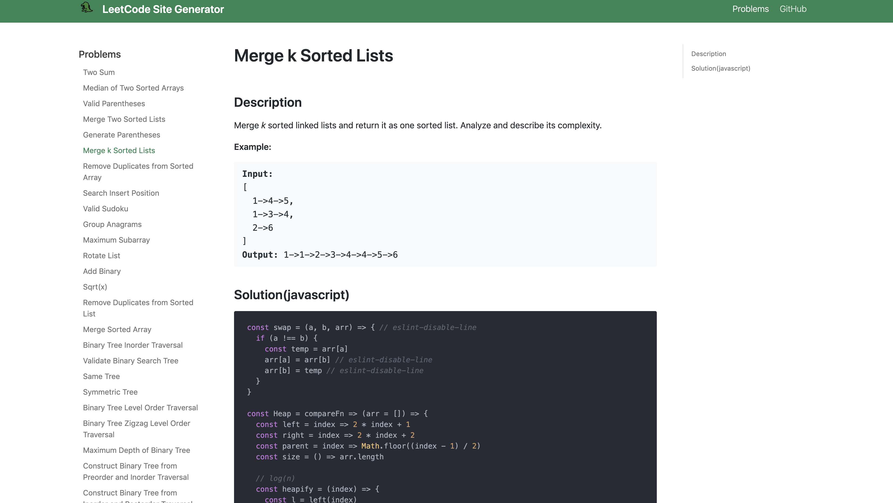
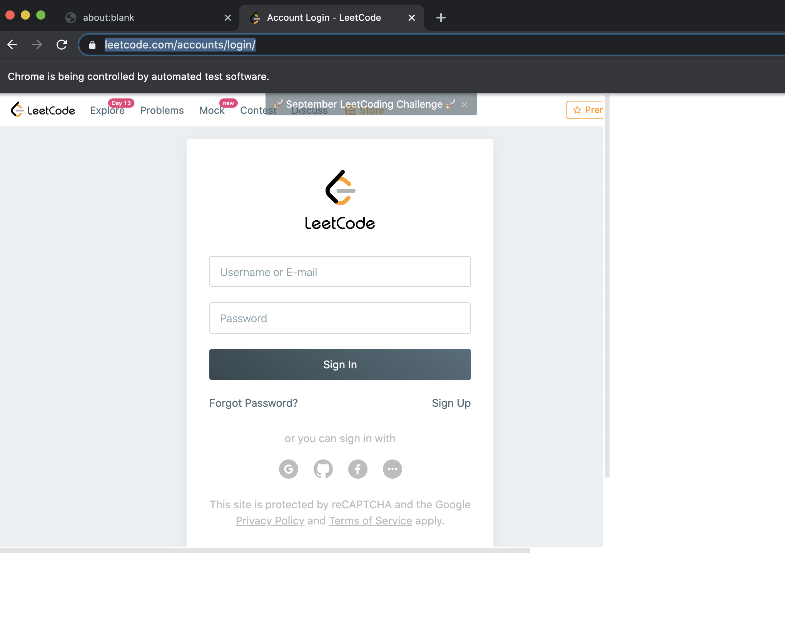

# LeetCode Site Generator
Generate your personal LeetCode website with one command!

## Example Website
[leetcode-solutions](https://beizhedenglong.github.io/leetcode-solutions/)

[](https://beizhedenglong.github.io/leetcode-solutions/)

## Requirements
- Make sure you have the recent version of [`node.js`](https://nodejs.org) installed.
- [`yarn`](https://yarnpkg.com/en/)(optional), you can use `npm`.


## Features
- Support both `leetcode.com` and `leetcode-cn.com` accounts.

## Installation

`yarn global add leetcode-site-generator` or `npm i -g leetcode-site-generator`

## Usage

1. Run installation script: `leetcode-site init`, This will create a project called `leet-site-base` on your current directory.
2. Go to the `website` directory of `leet-site-base`, run `yarn download`. It will open a popup window and ask you to input your LeetCode username and password.
   
3. Waiting for downloading process finished, then run `yarn & yarn start`.

## Publish to Github pages
1. Change the following keys in `siteConfig.js`
```js
 const siteConfig = {
   // ...
   url: 'https://beizhedenglong.github.io', // Your website URL
   baseUrl: '/leetcode-site-generator/', // Base URL for your project
   projectName: 'leetcode-site-generator', // Your project name
   organizationName: 'beizhedenglong', // Your github username
   // ...
 }
```

2. Run `GIT_USER=<your github username> CURRENT_BRANCH=master USE_SSH=true yarn run publish-gh-pages`


## List of commands

```md
Options:
  -V, --version       output the version number
  -h, --help          output usage information

Commands:
  download [options]  Download your new accepted code from LeetCode.
  init                Generate your personal LeetCode website.
  login               Log in to your Leetcode account.
  logout              Log out of current account.
```